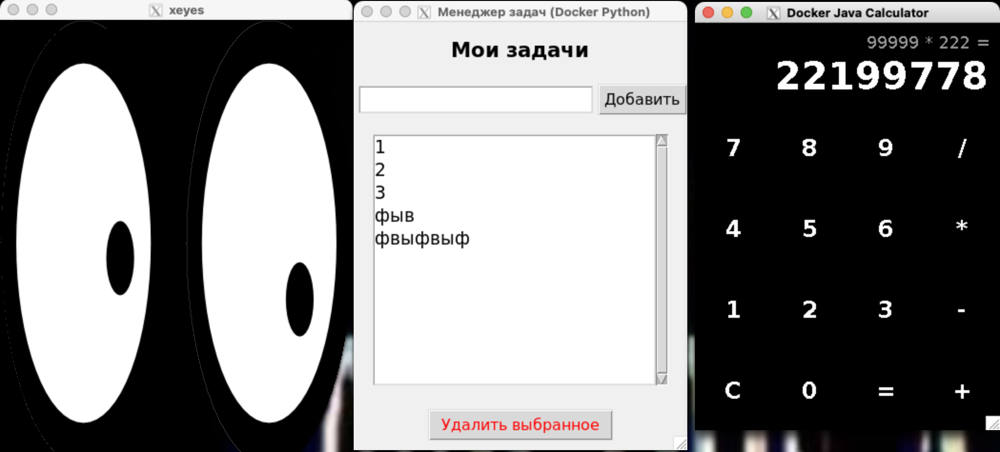

# Практическая работа: Развертывание GUI-приложений в Docker

**Студент:** [Ваши ФИО]
**Группа:** [Ваша группа]

## Цель работы
Изучить принципы работы с графическим интерфейсом внутри Docker-контейнеров на macOS с использованием XQuartz. Развернуть три оконных приложения в изолированных контейнерах, используя `docker-compose`.

## Теоретическая справка
macOS не использует X11 нативно. Для запуска GUI-приложений из Docker на Mac необходимо:
1. Использовать X-сервер для macOS — XQuartz.
2. Разрешить в XQuartz сетевые подключения.
3. Использовать специальный DNS-адрес `host.docker.internal:0` в переменной `DISPLAY` внутри контейнера, чтобы направить видеопоток на X-сервер хоста по TCP-протоколу.
4. Выполнить команду `xhost +localhost` для обхода ограничений безопасности X-сервера.

## Описание созданных контейнеров

### 1. xeyes
* **Базовый образ:** `ubuntu:22.04`
* **Описание:** Стандартная утилита X11 для проверки работоспособности графического сервера. Устанавливается через пакет `x11-apps`.

### 2. Java Calculator (javacalc)
* **Базовый образ:** `openjdk:17-jdk-slim` / `openjdk:17-slim`
* **Описание:** Приложение на Java Swing. Использована multi-stage сборка: на первом этапе происходит компиляция `.java` и упаковка в `.jar`, на втором — запуск с JRE. Добавлены X11-библиотеки (`libxext6`, `libxrender1`, `fontconfig`), требуемые для отрисовки окон Java Swing в Linux-среде.

### 3. Python GUI (pygui)
* **Базовый образ:** `python:3.10-slim`
* **Описание:** Дополнительное приложение, написанное на Python с использованием библиотеки `tkinter`. В Dockerfile установлен пакет `python3-tk`.

## Описание docker-compose.yml
Файл оркестрации собирает образы из локальных папок. Для каждого сервиса передана переменная `DISPLAY=host.docker.internal:0`. В отличие от Linux, проброс Volume с сокетом `/tmp/.X11-unix` не используется, так как Docker Desktop for Mac использует виртуальную машину и требует подключения по сети.

## Этапы запуска
1. Установка и настройка XQuartz (включение "Allow connections from network clients").
2. Выполнение команды `xhost +localhost` в терминале XQuartz.
3. Сборка и запуск контейнеров: `docker-compose up --build`.

## Скриншоты работы

## Вывод
В ходе работы успешно настроено взаимодействие Docker-контейнеров с графической подсистемой macOS через XQuartz. Развернуты три различных GUI-приложения, демонстрирующие универсальность данного подхода для разных языков программирования и библиотек (C, Java, Python).